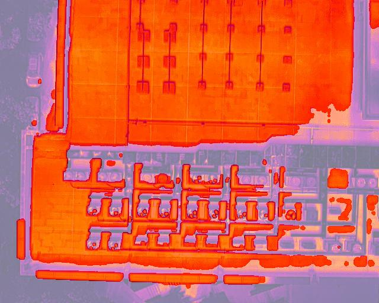
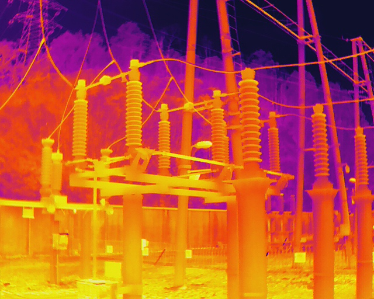

# 检测温度


## 检测图片中超出阈值的点

原图：


识别后结果：



## 检测图片中套管，并给出套管区域最高温度

原图：



识别后结果：


## API调用

### 检测图片中超出阈值的点
```python
@app.post("/process_image_threshold/")
async def process_image_threshold(file: UploadFile = File(...), threshold: float=Form (...)):
    contents = await file.read()
    photo_path = os.path.join(test_dir + file.filename)
    with open(photo_path, "wb") as f:
        f.write(contents)

    analyze_res, is_exist_exception, temperatures = mark_hot_points(photo_path, threshold)

    temperatures = np.array(temperatures).tolist()

    # 将处理后的图片保存到字节流
    byte_arr = io.BytesIO()
    analyze_res.save(byte_arr, format='JPEG')
    byte_arr.seek(0)

     # 将图片转换为Base64编码
    encoded_image = base64.b64encode(byte_arr.getvalue()).decode('utf-8')

    now = datetime.datetime.now()
    now_time = now.strftime("%Y-%m-%d %H:%M:%S")

    return JSONResponse(content={"status_code": 200,
                                 "temperatures": temperatures, 
                                 "image": encoded_image, 
                                 "is_exist_exception": is_exist_exception, 
                                 "time": now_time})
```

### 检测图片中套管，标出温度最高值

```python

@app.post("/process_insulator/")
async def process_insulator(file: UploadFile = File(...)):
    contents = await file.read()
    photo_path = os.path.join("test_file/" + file.filename)
    with open(photo_path, "wb") as f:
        f.write(contents)

    temperatures = get_temperature_ndarray(photo_path)

    predicted_results = model([photo_path]) 
    boxes = predicted_results[0].boxes.xyxy.to("cpu").numpy().astype(np.int32)
    img = cv2.imread(photo_path)
    for box in boxes:
        x_min, y_min, x_max, y_max = box

        max_temp = np.max(temperatures[y_min:y_max, x_min:x_max])

        # 在图片上绘制矩形框
        cv2.rectangle(img, (x_min, y_min), (x_max, y_max), (255, 255, 255), 2)
        center_y = (y_min + y_max) // 2

        # 获取文本的大小
        text = f"{max_temp:.2f}"
        font_scale = 0.5  # 字体大小与之前一致
        font_thickness = 2

        # 获取文本的大小
        (text_width, text_height), _ = cv2.getTextSize(text, cv2.FONT_HERSHEY_SIMPLEX, font_scale, font_thickness)

        # 计算文本的中心点
        text_x = x_min + (x_max - x_min - text_width) // 2
        text_y = center_y + text_height // 2
        # 绘制文本
        cv2.putText(img, text, (text_x, text_y),
                    cv2.FONT_HERSHEY_SIMPLEX, font_scale, (255, 255, 255), font_thickness)

    _, byte_arr = cv2.imencode(".jpg", img)

    # 将图片转换为Base64编码
    encoded_image = base64.b64encode(byte_arr).decode('utf-8')

    now = datetime.datetime.now()
    now_time = now.strftime("%Y-%m-%d %H:%M:%S")

    return JSONResponse(content={"status_code": 200,
                                 "image": encoded_image, 
                                 "time": now_time})
                                 
```


